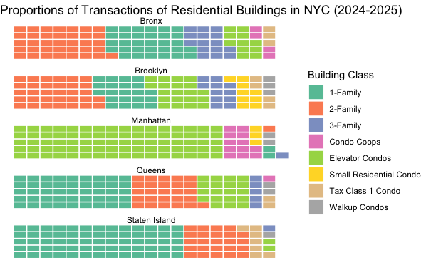

# NYC Residential Property Sales Analysis

A reproducible R pipeline for ingesting, cleaning, geocoding, and visualizing five-borough rolling-sales data from the NYC Department of Finance (May 2024–Apr 2025), with spatial analysis via the PLUTO shapefile.
Processed & Cleaned Large-Scale Sales Data: Ingested and standardized over 120,000 rolling‑sales records spanning May 2024–April 2025 across all five NYC boroughs, recoding 30+ variables and handling 25,000+ zero‑price deed transfers to ensure a clean, analysis‑ready dataset.

This project demonstrates tabular-to-spatial data integration using NYC's municipal identifier system (BBL), with explicit handling of data quality issues common in infrastructure asset datasets.

## Project Overview

- **Goal:** Examine how transaction volume, price, and building class distributions vary across NYC’s five boroughs.  
- **Timeframe:** May 2024 – April 2025  
- **Scope:**  
  - 120,000+ sales records  
  - All residential building classes (1-Family through Walk-up Condos)  
  - Spatial centroid join using PLUTO shapefile  
- Geocoded 100% of Transactions: Merged Department of Finance sales data with the PLUTO shapefile (856,734 features) to compute centroids and attach latitude/longitude to every record, enabling precise spatial mapping of property sales.

## Data Visualization

  

## Data Sources

1. [NYC Annulized Property Sales](<https://www.nyc.gov/site/finance/property/property-annualized-sales-update.page>)
2. [PLUTO Shapefile (NYC Planning)  ](<https://data.cityofnewyork.us/City-Government/Primary-Land-Use-Tax-Lot-Output-PLUTO-/64uk-42ks/about_data>)
3. [U.S. Consumer Price Index](<https://www.bls.gov/cpi/>)

---

## Features

- **Pipeline in R** using `dplyr`, `sf`, `lubridate`, `stringr`  
- **Geocoding**: centroids of 856,734 PLUTO polygons → lat/long  
- **Plots** with `ggplot2` + `patchwork`   
- **Report generation** in R Markdown  

---

